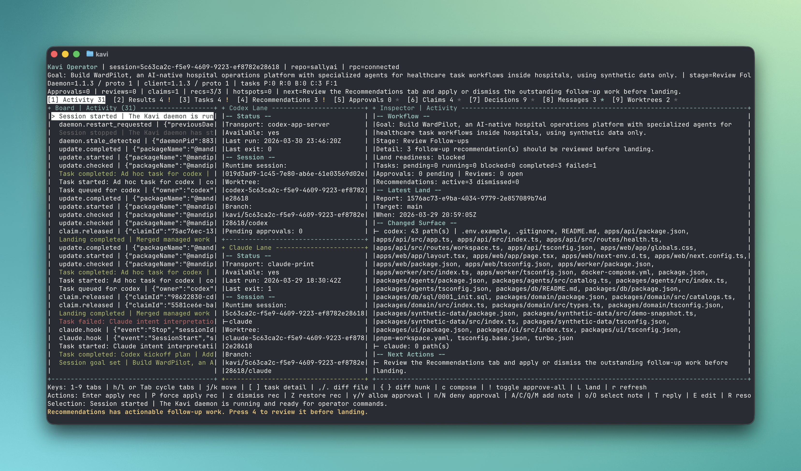

<div align="center">

# Kavi

### The multi-agent TUI orchestrator for your terminal.

Kavi puts Claude Code and OpenAI Codex side-by-side in a single terminal session,<br>
routes work to the right agent, and merges their output into one clean result.

[](https://www.npmjs.com/package/@mandipadk7/kavi)
[](./LICENSE)
[](https://nodejs.org)

<br>



<br>

[Install](#install) &nbsp;&middot;&nbsp; [Quick Start](#quick-start) &nbsp;&middot;&nbsp; [Features](#features) &nbsp;&middot;&nbsp; [Commands](#commands) &nbsp;&middot;&nbsp; [Configuration](#configuration) &nbsp;&middot;&nbsp; [Architecture](#architecture) &nbsp;&middot;&nbsp; [Contributing](#contributing)

</div>

<br>

## Why Kavi?

You already use Claude Code. Maybe you use Codex too. But switching between them is friction — separate terminals, separate context, no coordination.

Kavi fixes that. It runs both agents as headless child processes, gives each its own git worktree, routes tasks based on what each agent is best at, and merges their changes when they're done. You interact with Kavi; Kavi talks to the agents.

**What you get:**

- **One terminal, two agents.** Claude and Codex run simultaneously in isolated worktrees. No tab-switching, no copy-pasting context.
- **Smart routing.** Kavi decides which agent handles each task — by keyword rules, path ownership, or AI classification. Override anytime.
- **DAG-based planning.** Complex goals get decomposed into a task graph with dependencies. Parallel where possible, sequential where required.
- **Approval gates.** Every tool invocation (shell commands, file writes) goes through you first. Approve once, remember for the session.
- **Clean merges.** When both agents are done, `kavi land` merges their worktree changes to your base branch with conflict detection.
- **Full audit trail.** Every decision, routing choice, approval, and code review is logged. Replay any session.

<br>

## Install

```bash
npm install -g @mandipadk7/kavi
```

**Prerequisites:**
- **Node.js 25+** — Kavi uses native TypeScript stripping (`node:module`) and the built-in SQLite module
- **Claude Code CLI** — [install instructions](https://docs.anthropic.com/en/docs/claude-code/overview)
- **Codex CLI** — [install instructions](https://github.com/openai/codex)
- **Git** — for worktree management

Verify everything is wired up:

```bash
kavi doctor
```

<br>

## Quick Start

**1. Initialize a project**

```bash
cd your-project
kavi init
```

This creates a `.kavi/` directory with default config, routing rules, and agent prompts.

**2. Start a session**

```bash
kavi open --goal "Add user authentication with JWT tokens"
```

The TUI launches. Kavi routes your goal to the planner, which decomposes it into a task graph. Tasks get assigned to Claude or Codex based on routing rules.

**3. Work with the agents**

Use the TUI tabs to monitor progress:

| Key | Tab | What it shows |
|-----|-----|---------------|
| `1` | Activity | Live event stream |
| `2` | Results | Mission status and agent output |
| `3` | Tasks | Task list with status (pending/running/completed/failed) |
| `4` | Plan | Execution DAG visualization |
| `5` | Approvals | Pending tool-use approval requests |
| `6` | Reviews | Code review notes from agents |
| `7` | Recommendations | Suggested handoffs and follow-ups |
| `8` | Brain | Knowledge base entries |
| `9` | Claims | File ownership per agent |
| `0` | Decisions | Full decision ledger |

**4. Land the result**

When tasks complete, merge everything to your branch:

```bash
kavi land
```

Kavi detects worktree overlaps, runs your validation command, and produces a land report.

<br>

## Features

### Multi-Agent Orchestration

Kavi spawns Claude Code and Codex as child processes, each in its own git worktree. They work in parallel without stepping on each other's files. Agent-to-agent peer messages enable coordination — handoffs, review requests, context sharing, and blocking signals.

### Intelligent Task Routing

```
┌──────────────┐
│  Your prompt  │
└──────┬───────┘
       │
  ┌────▼─────┐     ┌─────────────────┐
  │ Path-claim │────▶  Deterministic   │ confidence: 0.95
  │  routing   │     │  (file rules)   │
  └────┬───────┘     └─────────────────┘
       │ no match
  ┌────▼─────┐     ┌─────────────────┐
  │ Keyword   │────▶  Heuristic       │ confidence: 0.92
  │  routing  │     │  (domain words) │
  └────┬──────┘     └─────────────────┘
       │ ambiguous
  ┌────▼─────┐     ┌─────────────────┐
  │ AI router │────▶  LLM classifier  │ confidence: 0.65+
  └────┬──────┘     └─────────────────┘
       │ fallback
  ┌────▼─────┐
  │  Codex    │ confidence: 0.35
  └───────────┘
```

Configure which agent owns which files in `.kavi/kavi.toml`:

```toml
[routing]
codex_paths  = ["src/api/**", "src/server/**", "migrations/**"]
claude_paths = ["src/ui/**", "src/components/**", "*.css"]
```

### Execution Plans (DAG)

When a goal is complex, Kavi's planner decomposes it into a directed acyclic graph:

```
 scaffold ──► backend ──► integration
                 │              ▲
                 │              │
              tests ────────────┘
                 ▲
 scaffold ──► frontend
```

Nodes run in parallel when they can, block when they must. Each node becomes a task assigned to the right agent.

### Missions

Missions wrap a goal with structure — spec, acceptance criteria, risk assessment, and autonomy policy.

```bash
# Set how hands-on you want to be
kavi mission policy latest --guided          # approve everything
kavi mission policy latest --autonomous      # agents run free
kavi mission policy latest --overnight       # auto-verify + auto-land

# Run a shadow mission to compare approaches
kavi mission shadow latest --prompt "Try a different auth strategy"
kavi mission compare --family latest
```

### Brain (Knowledge Base)

Kavi captures facts, decisions, procedures, and risks as the session progresses. The brain persists across tasks so agents don't rediscover what's already known.

```bash
kavi brain --query "auth"                    # search entries
kavi brain --category decision               # filter by type
kavi brain --graph                           # visualize relationships
kavi brain-pin <entry-id>                    # pin important entries
```

### Patterns

Reusable workflow patterns extracted from successful missions. Apply them to new tasks:

```bash
kavi patterns                                # list all patterns
kavi patterns rank "add stripe billing"      # find relevant patterns
kavi patterns apply <id> --prompt "..."      # apply to new work
kavi patterns constellation                  # see pattern relationships
```

### Code Reviews

Agents emit structured review notes on their diffs — concerns, questions, approvals, and accepted risks. You review before landing.

```bash
kavi reviews                                 # list open reviews
kavi reviews --status open --agent codex     # filter by agent
```

### Approval System

Every agent tool invocation (shell commands, file writes) requires your approval. The system learns:

```bash
kavi approvals                  # see pending requests
kavi approve latest             # approve the most recent
kavi approve latest --remember  # approve and remember for the session
kavi deny latest                # deny a request
```

Or bypass entirely with `kavi open --approve-all` when you trust the agents.

<br>

## Commands

### Session

| Command | Description |
|---------|-------------|
| `kavi init` | Initialize `.kavi/` project scaffold |
| `kavi open --goal "..."` | Launch TUI session |
| `kavi start --goal "..."` | Start a new session |
| `kavi resume` | Resume last active session |
| `kavi stop` | Stop the active daemon |
| `kavi status` | Session status |
| `kavi doctor` | Run health checks |
| `kavi update` | Update Kavi |

### Tasks & Planning

| Command | Description |
|---------|-------------|
| `kavi task "prompt"` | Enqueue a task |
| `kavi task --agent codex "prompt"` | Route to a specific agent |
| `kavi task --plan "prompt"` | Force planning mode |
| `kavi tasks` | List all tasks |
| `kavi task-output latest` | Get task output |
| `kavi retry latest` | Retry a failed task |
| `kavi plan` | Preview execution plan |
| `kavi route "prompt"` | Preview routing decision |

### Missions

| Command | Description |
|---------|-------------|
| `kavi missions` | List missions |
| `kavi mission latest` | Mission details |
| `kavi mission policy latest --guided` | Set autonomy level |
| `kavi mission shadow latest --prompt "..."` | Run shadow variant |
| `kavi mission compare --family latest` | Compare variants |
| `kavi accept latest` | Run acceptance checks |
| `kavi land` | Merge worktrees to base branch |

### Knowledge & Review

| Command | Description |
|---------|-------------|
| `kavi brain` | Browse knowledge base |
| `kavi patterns` | List reusable patterns |
| `kavi reviews` | Code review notes |
| `kavi approvals` | Pending approval requests |
| `kavi decisions` | Decision ledger |
| `kavi claims` | File ownership claims |
| `kavi events` | Session event stream |
| `kavi recommend` | View recommendations |

All commands support `--json` for scripting.

<br>

## Configuration

### Project config — `.kavi/kavi.toml`

```toml
version = 1
base_branch = "main"
validation_command = "npm test"    # run before landing
message_limit = 6

[routing]
# Keywords that route to each agent
frontend_keywords = ["frontend", "ui", "ux", "design", "react", "css"]
backend_keywords  = ["backend", "api", "server", "db", "schema", "auth"]

# File path ownership (glob patterns)
codex_paths  = ["src/api/**", "src/server/**"]
claude_paths = ["src/ui/**", "src/app/**"]

[agents.codex]
role = "planning-backend"

[agents.claude]
role = "frontend-intent"
```

### User config — `~/.kavi/config.toml`

```toml
version = 1

[runtime]
codex_bin = "codex"     # path to Codex CLI
claude_bin = "claude"   # path to Claude Code CLI
```

### Agent prompts — `.kavi/prompts/`

Drop a `codex.md` or `claude.md` in `.kavi/prompts/` to customize the system prompt each agent receives.

<br>

## Architecture

```
┌─────────────────────────────────────────────────────────────┐
│                        You (Terminal)                        │
└─────────────────────────┬───────────────────────────────────┘
                          │
              ┌───────────▼───────────┐
              │      Kavi TUI         │
              │  tabs · composer ·    │
              │  real-time snapshot   │
              └───────────┬───────────┘
                          │ Unix socket (JSON-RPC)
              ┌───────────▼───────────┐
              │     Kavi Daemon       │
              │  router · scheduler · │
              │  planner · brain ·    │
              │  approval engine      │
              └──────┬─────────┬──────┘
                     │         │
          ┌──────────▼──┐  ┌───▼──────────┐
          │ Claude Code │  │  Codex CLI   │
          │  (child)    │  │ (app-server) │
          └──────┬──────┘  └───┬──────────┘
                 │             │
          ┌──────▼──────┐  ┌───▼──────────┐
          │ git worktree │  │ git worktree │
          │ kavi-claude  │  │ kavi-codex   │
          └─────────────┘  └──────────────┘
```

**Key design decisions:**

- **Zero UI dependencies.** The TUI is built with raw ANSI escape codes and Node.js `readline`. No Ink, no React, no Blessed. Just escape sequences and a render loop.
- **Native TypeScript.** Uses Node 25's built-in `--experimental-strip-types` for dev and `node:module.stripTypeScriptTypes` for the production build. No tsc, no bundler.
- **Built-in SQLite.** Uses Node 25's `node:sqlite` for structured storage. No external database.
- **Worktree isolation.** Each agent gets its own git worktree. They can write to any file without conflicts. Merges happen at land time with explicit overlap detection.
- **Event-sourced state.** Session state is a JSON record, complemented by an append-only JSONL event log. Every mutation is traceable.

<br>

## TUI Keyboard Shortcuts

| Key | Action |
|-----|--------|
| `1`–`0` | Switch tabs |
| `Tab` | Cycle tabs forward |
| `h` / `l` | Navigate tabs left/right |
| `j` / `k` | Scroll up/down |
| `Enter` | Submit prompt from composer |
| `i` | Focus composer |
| `r` | Refresh |
| `L` | Land changes |
| `y` / `Y` | Approve / approve all |
| `n` / `N` | Deny / deny approval |
| `q` | Quit |

<br>

## Building from Source

```bash
git clone https://github.com/mandipadk/kavi.git
cd kavi
npm run build
node ./bin/kavi.js doctor
```

Or run directly from source (requires Node 25+):

```bash
node --experimental-strip-types ./src/main.ts
```

<br>

## Contributing

Contributions welcome. Open an issue first for anything non-trivial so we can discuss the approach.

```bash
# Run from source during development
npm run dev

# Run tests
npm test

# Build production JS
npm run build
```

<br>

## License

[MIT](./LICENSE)

<br>

<div align="center">

Built by [Mandip Adhikari](https://github.com/mandipadk)

</div>
